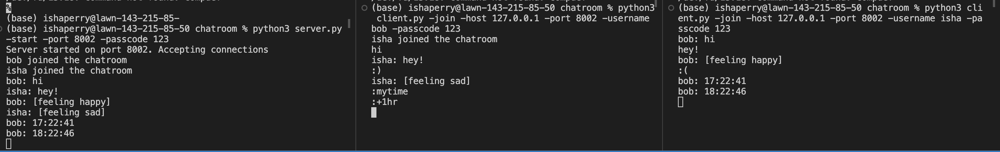

# chatroom
python multi-client chatroom

## Getting Started
Starting the server: `python3 server.py -start -port <port> -passcode <passcode>`

Joining the server: `python3 client.py -join -host <hostname> -port <port>
-username <username> -passcode <passcode>`

Client must have the correct passcode to join.

## Application Protocol
Uses Text parsing to develop a custom application layer protocol

  a. Type :) to display [feeling happy]
  
  b. Type :( to display [feeling sad]
  
  c. Type :mytime to display the current time
  
  d. Type :+1hr to display the current time + 1 hour
  
  e. Type :Exit to close your connection and terminate the client

